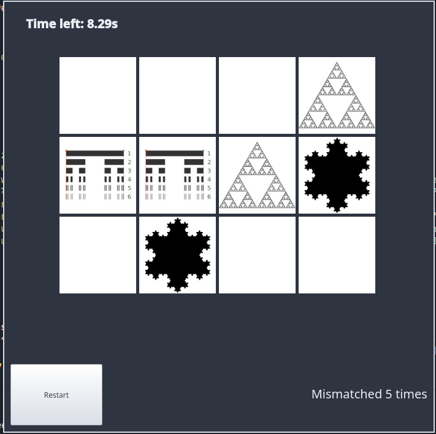
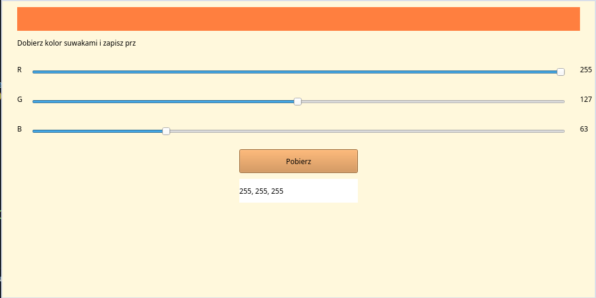
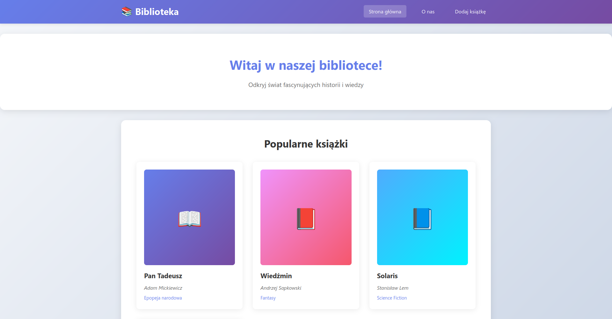
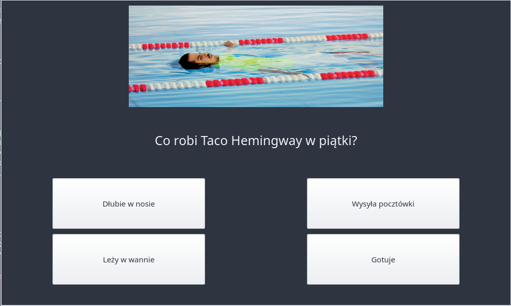
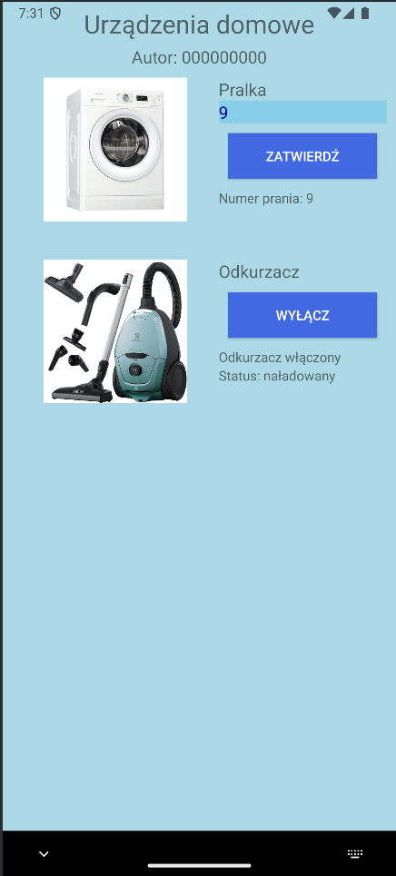

# INF04
To repozytorium zawiera rozwiązanie egzaminy INF04 z poprzednich lat. Egzamin INF04 jest w Polsce wymagany aby uzyskać tytuł technika programisty. Dodatkowo w folderze /additional_excerisises są dodatkowe zadania przygotowujące przygotowane przez nauczycieli, lub innych internetowych twórców.

## Stack:
 - Console apps - Python
 - Web apps - Node.js + React
 - Mobile Apps - Java (Android)
 - Desktop Apps - Python with PyQt6

## Screenshots

# Rodmap

## Webówki
 - 2 egzaminy
 - Zadania od pawcia

## Mobilki
 - 5 egzaminów
 - Zadania od pawcia

## Desktop
 - Egzaminy
 - Kalkulator
 - File manager

## Matma
 - Repetytoria, zadania

# Czas i lekcje
 - Poniedziałek - 4 godziny (matma)
 - Wtorek - brak
 - Środa - 2 godziny (matma)
 - Czwartek - 6 godzin (cały dzięń egzaminy zawodowe po 2h każdy)
 - Piątek - 4 godziny (matma na historii i wosie, na testowaniach zawodowe)

 Do egzaminów zawodowych - 16h * 19tyg = 304h
 Łącznie - 16h * 30 tyg = 480h 

 Rozkłada się to na:
 - 50h na każdy zawodowy = 150h (po 16% czasu w tygodniu każdy do stycznia)
 - 150h matmy do stycznia (50% czasu w tygodniu)
